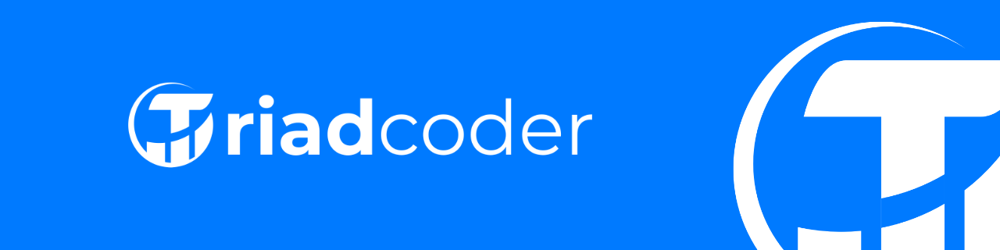

## About

Triadcoder is a software house focused on building scalable digital solutions, web systems, APIs, SaaS platforms and automation tools.

---

## Engineering culture

The organization centralizes:

- development standards
- Git workflows
- automation
- technical documentation
- continuous integration
- scalable software architecture

---

## Standards

All repositories follow:

- GitHub Flow
- Pull Request reviews
- standardized commits
- issue templates
- engineering guidelines
- security best practices

---

## Tech stack

### Backend (API / Services)

---

### Full-stack (Monolithic Web Systems)

---

### Frontend

---

### Infrastructure

---

### Databases

